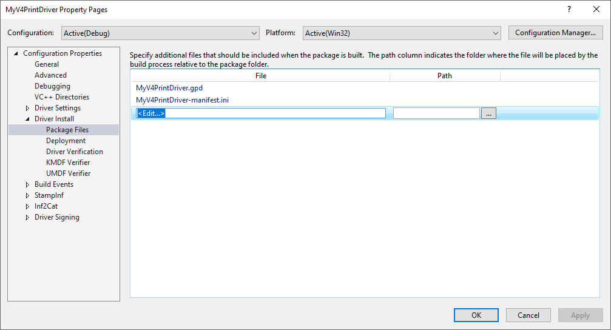
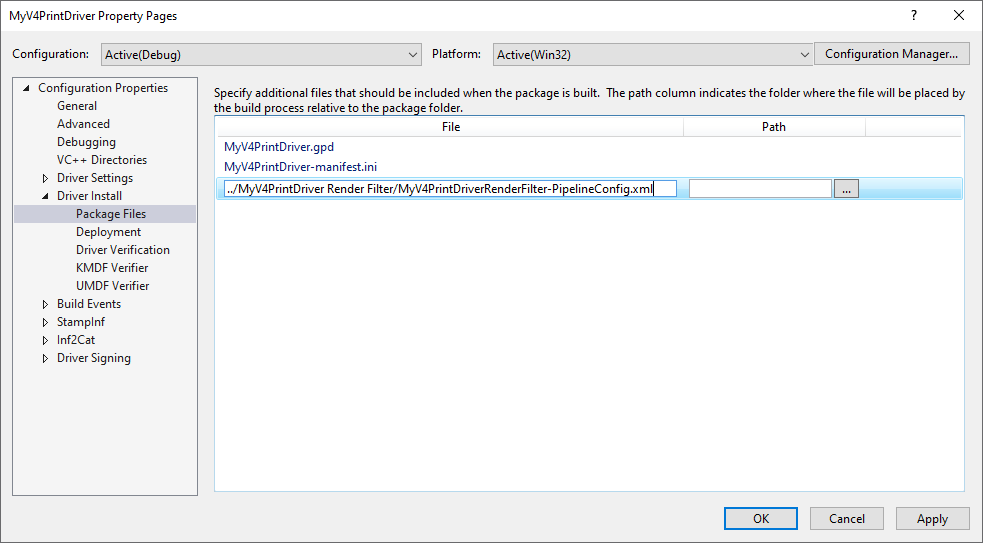

# Build a basic v4 printer driver

[!include[Print Support Apps](../includes/print-support-apps.md)]

[!include[Print driver end of life servicing](../includes/print-eol-servicing.md)]

> [!WARNING]
> This printer driver tutorial contains multiple errors and is not usable at this time.

Build a basic v4 printer driver by using the driver development wizard in Microsoft Visual Studio 2019 to select the minimum set of features to create a functional printer driver.

The instructions in this topic will focus on the steps required for building a driver, and will not explain the many printer driver options available in the wizard.

The intent of this topic is to provide an introduction to the process involved when developing a printer driver in Visual Studio 2019.

A more detailed look at the printer driver options is provided in [Exploring the driver options in the wizard](exploring-the-driver-options-in-the-wizard.md).

## Prerequisites

Follow the guidance in [Download the Windows Driver Kit (WDK)](../download-the-wdk.md) and ensure you have completed the following items:

1. Install Visual Studio 2019 with the **Desktop development with C++** workload and the correct version of the **Windows 10 SDK**.

1. Install the Windows Driver Kit (WDK) for Windows 10, version 2004.

1. Install the Windows Driver Kit (WDK) extension for Visual Studio 2019.

## Select features for the basic driver

1. In Visual Studio, in the main menu, select **File** > **New** > **Project**.

1. In the **New Project** window, in the top-right search box, type *printer driver v4* and press enter. This will retrieve all driver templates whose names contain the search text.

1. In the middle pane, select **Printer Driver V4**.

1. Type a name for your driver in the **Name** field, and then select **OK**. For example, you could type *MyV4PrintDriver*.

1. In the **Create a v4 Print Driver Wizard**, under **Choose the driver rendering type:**, select **V4 print driver with custom rendering filters (accepts XPS only)**.

1. Leave all other options at their default settings and select **Next**.

1. In the **Setup information** section of the wizard, leave all options at their default settings, then select **Next**.

1. In the **Setup information (page 2)** section of the wizard, leave all options at their default settings, then select **Next**.

Microsoft Visual Studio uses the preceding selections to generate the project files for *MyV4PrintDriver*.

## Verify the generated driver files

1. Navigate to the folder for the generated driver files. For example, if you named your project *MyV4PrintDriver*, then by default, the files would be saved to the following location: *My Documents > Visual Studio 2019 > Projects > MyV4PrintDriver > MyV4PrintDriver*.

1. Verify that the folder contains the following files:

    | File name | File type |
    |--|--|
    | MyV4PrintDriver.gpd | Printer description file |
    | MyV4PrintDriver.inf | Setup information file |
    | MyV4PrintDriver.vcxproj | C++ Project file |
    | MyV4PrintDriver.vcxproj.filters | C++ Project filters file |
    | MyV4PrintDriver-manifest.ini | Configuration settings file (the print driver manifest) |
    | V4PrintDriver-Intellisense.js | JavaScript file for Intellisense |
    | V4PrintDriver-Intellisense-Windows8.1.js | JavaScript file for Intellisense |

Notice from the preceding table that one of the files that is created is an INF file. Note that Visual Studio created a skeletal INF file that has to be completed so that it can be used to install the driver.

## Create a unique **PrinterDriverID** for the driver

1. In the Visual Studio Tools menu select **Create GUID**.

1. Select option **4. Registry Format** and select the **Copy** button.

1. In Visual Studio, in the **Solution Explorer**, expand the *MyV4PrintDriver* node.

1. Select **Driver Files**, then in the **Properties** window, look at the value for the *Unique Identifier* field. Replace this value with the GUID you generated using **Paste**.

## Complete the INF file

In the MyV4PrintDriver project there should be an entry for **Driver Files**. Open this and the file MyV4PrintDriver.inf should be listed. Open this file.

### 1. Update the Copyright notice

The first 2 lines of the INF file are the copyright notice for the driver package.

Line 1 contains the year and name of your company. Replace the characters YYYY with the current year and replace the characters <*Your manufacturer name*> with the name of your company.

Line 2 describes the contents of the driver INF including Manufacturer name and device Model information. Replace the characters <*Your manufacturer name*> with the name of your company and replace the characters of <*Printer Model*> with the model name of the printer supported by the driver.

For example, if the year is 2021 and your company's name is Fabrikam, and the print device model is 1234, you would type the following:

```inf
; Copyright (c) 2021 Fabrikam
; INF file for the Fabrikam 1234 print driver
```

### 2. Verify the **\[Version\]** section is correct

Find the line containing **\[Version\]**.

- Check and make sure that you see this line:

    ```inf
    ClassVer=4.0
    ```

- Check and make sure that you see this line:

    ```inf
    Signature="$WINDOWS NT$"
    ```

### 3. Configure the **\[SourceDisksFiles\]** section

Find the line containing **\[SourceDisksFiles\]**.

Below this type the following lines:

```inf
MyV4PrintDriver.gpd=1
MyV4PrintDriver-manifest.ini=1
MyV4PrintDriverRenderFilter-PipelineConfig.xml=1
MyV4PrintDriverRenderFilter.dll=1
```

### 4. Configure the **\[DriverFiles\]** section

Find the line containing **\[DriverFiles\]**.

Below this type the following lines:

```inf
MyV4PrintDriver.gpd
MyV4PrintDriver-manifest.ini
MyV4PrintDriverRenderFilter-PipelineConfig.xml
MyV4PrintDriverRenderFilter.dll
```

### 5. Configure the **\[Standard.NT$ARCH$\]** section

Find the line containing **\[Standard.NT$ARCH$\]**.

This section references the `Install` section of the INF for each model. For example, if the model of your printer is Fabrikam 1234, then you would type the following:

```inf
"Fabrikam 1234"=DriverInstall, USBPRINT\\Fabrikam1234
"Fabrikam 1234"=DriverInstall, WSDPRINT\\Fabrikam1234
```

### 6. Add the **PrinterDriverID** to the INF file

In Visual Studio, in the **Solution Explorer**, expand the *MyV4PrintDriver* node.

Select **Driver Files**, then in the **Properties** window look at the value for the *Unique Identifier* field. This is the driver ID (the GUID). Highlight it and copy it.

In the INF file, in the **\[Standard.NT$ARCH$\]** section, type the following line:

```inf
"Fabrikam 1234"=DriverInstall,
```

And then after the comma, paste the GUID that you copied in the preceding step. The completed **\[Standard.NT$ARCH$\]** section should look like the following:

```inf
"Fabrikam 1234"=DriverInstall, {GUID}
"Fabrikam 1234"=DriverInstall, USBPRINT\Fabrikam1234
"Fabrikam 1234"=DriverInstall, WSDPRINT\Fabrikam1234
```

### 7. Configure the **\[Strings\]** section

Find the line containing **\[Strings\]**.

Below this you will find the definition of the *ManufacturerName* string. Replace the characters <*Your manufacturer name*> with the name of your company to provide a manufacturer's name for the target printer and delete the rest of the line containing the ;TODO:

For example, if your company's name is Fabrikam, you would type the following:

```inf
ManufacturerName="Fabrikam"
```

### 8. Save the INF file

When you complete the INF file, it should look like the following:

```inf
; Copyright (c) 2021 Fabrikam
; INF file for the Fabrikam 1234 print driver

[Version]
Signature="$Windows NT$"
Class=Printer
ClassGuid={4D36E979-E325-11CE-BFC1-08002BE10318}
Provider=%ManufacturerName%
CatalogFile=MyV4PrintDriver.cat
ClassVer=4.0
DriverVer=03/17/2014,1.0.0.0
PnpLockdown=1

[Manufacturer]
%ManufacturerName%=Standard,NT$ARCH$

[Standard.NT$ARCH$]
"Fabrikam 1234"=DriverInstall, {GUID}
"Fabrikam 1234"=DriverInstall, USBPRINT\Fabrikam1234
"Fabrikam 1234"=DriverInstall, WSDPRINT\Fabrikam1234

[DriverInstall]
CopyFiles=DriverFiles

[DriverFiles]
MyV4PrintDriver.gpd
MyV4PrintDriver-manifest.ini
MyV4PrintDriverRenderFilter-PipelineConfig.xml
MyV4PrintDriverRenderFilter.dll

[DestinationDirs]
DefaultDestDir = 66000

[SourceDisksNames]
1 = %DiskName%,,,""

[SourceDisksFiles]
MyV4PrintDriver.gpd=1
MyV4PrintDriver-manifest.ini=1
MyV4PrintDriverRenderFilter-PipelineConfig.xml=1
MyV4PrintDriverRenderFilter.dll=1

[Strings]
ManufacturerName="Fabrikam"
DiskName="MyV4PrintDriver Installation Disk"
```

## Update the **Driver Files** list

1. In Visual Studio, in the **Solution Explorer**, expand the *MyV4PrinterDriver* node.

1. Select the file MyV4PrintDriver.gpd and drag it to the **Driver Files** node.

1. Do the same with MyV4PrintDriver-manifest.ini.

## Add the Pipeline Config file to the driver package

1. In the **Solution Explorer**, select and hold (or right-click) *MyV4PrintDriver* project, then select **Properties**.

1. In the **MyV4PrintDriver Property Pages** window, expand **Configuration Properties** in the left pane.

1. Expand **Driver Install**, then select **Package Files**.

1. In the right pane, select, then click the &lt;Edit...&gt; row in the listed files.

    

1. Replace the placeholder with the relative path of pipeline config file, for example, `../MyV4PrintDriver Render Filter/MyV4PrintDriverRenderFilter-PipelineConfig.xml`, then click **OK**.

    

## Add a reference to the render filter to the driver package

1. In Visual Studio, in the **Solution Explorer**, expand the *MyV4PrinterDriver* node.

1. Select and hold (or right-click) the **References** node -> select **Add Reference**.

1. Select the check box for *MyV4PrintDriver Render Filter*, then select **OK**.

## Configure the driver solution for debugging and deployment

1. In the **Solution Explorer**, select and hold (or right-click) *MyV4PrintDriver* project, then select **Properties**.

1. In the **MyV4PrintDriver Property Pages** window, expand **Configuration Properties** in the left pane.

1. Expand **Driver Install**, then select **Deployment**. Do the following in the right pane:

    - Ensure that the **Target Computer Name** is configured. If not, select "..." and follow the prompts in the **Configure Devices** wizard to set up a remote target computer.

    - Check **Remove previous driver versions before deployment**.

    - Select **Install/Reinstall and Verify**, then select **Default Printer Driver Package Installation Task** from the drop-down box.

    - Type the name of the driver in the **Optional Arguments** field (without any quotes around the name).

    - Select **OK**.

## Configure driver signing

1. In the **Solution Explorer**, select and hold (or right-click) *MyV4PrintDriver* project, then select **Properties**.

1. In the **MyV4PrintDriver Property Pages** window, expand **Configuration Properties** in the left pane.

1. Expand **Driver Signing**, then select **General**.

1. In the right pane, confirm that **Sign Mode** is set to Test Sign.

1. Select **Test Certificate**, then select **Create Test Certificate...** from the drop-down box.

1. Select **TimeStampServer**, then select Verisign from the drop-down box.

1. Select **OK**.

## Build and deploy the driver

1. In **Solution Explorer**, select and hold (or right-click) *Solution MyV4PrintDriver (2 projects)*, and select **Build Solution**.

1. When the build process is complete the driver will automatically be installed. Make sure that there are no errors in the **Output** window.

## Test the driver

Create a print queue using either plug-and-play or the **Add Printer Wizard**.

For more information about INF files for the v4 printer driver, see [V4 Driver INF](v4-driver-inf.md).

In addition to the files in the preceding table, notice that a *MyV4PrintDriver Render Filter* folder was created. This is the render filter project template and it provides a good foundation for building an XPS rendering filter and an XPS filter pipeline configuration file. For more information about XPS rendering filters, see [XPSDrv Render Module](xpsdrv-render-module.md).
